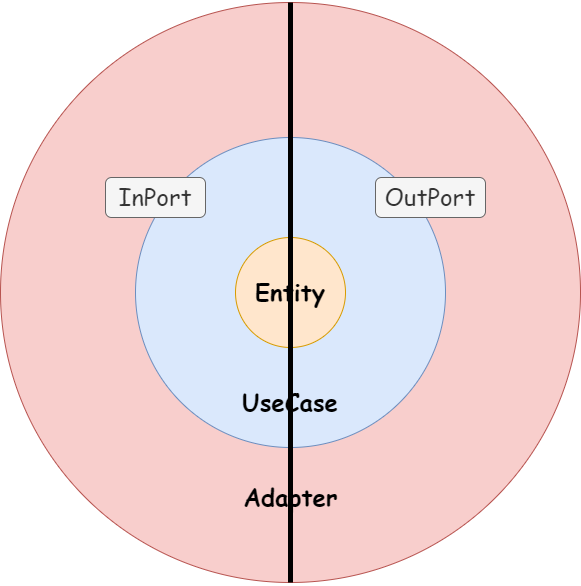

# SoftwareArchitecture 

專案本身套用了Clean Architecture分層命名，Domain Driven Design 與 CQRS 概念。
並使用 ArchUnitNET 架構單元測試，來避免架構腐化。

## 架構說明
整潔架構認為商業邏輯是整個專案裡面穩定及最需要進行單元測試進行測試的核心。WebApi 只是展現UseCase的一種細節。
資料庫也是實作的細節。在實作業務邏輯不應該優先考量細節的。

- Entity 層:主要為領域模型實作。專案類別庫命名上以***Entity***作為結尾。
    

- UseCase 層:主要為使用案例定義與實作。專案類別庫命名上以***UseCase***作為結尾。
    - Input Port : UseCase被其他Adapter依賴。UseCase 需要明確實作CommandHandler或是QueryHandler。

      | CQRS UseCase Type | Write| Read|
      |-------------------| -------- | -------- |
      | CommandHandler    | Repository| Inquiry|
      | QueryHandler      |Archive|Projection|
  
    - Output Port : UseCase依賴其他Adapter。

- Adapter 層:主要為調用UseCase或是被UseCase調用。OutAdapter專案命名則是以***Persistence***結尾。
    - Input Adapter : .Net WebApi : 調用UseCase來完成該API任務。
    - Output Adapter : MSSQL : 被UseCase依賴，

---

## 架構測試規則說明

在架構測試裡面分成四個資料夾。

ClassDependencies:類別依賴

ClassEnforcements:類別執行、類別職責

LayerDependencies:分層依賴

Naming Conventions:命名規範

