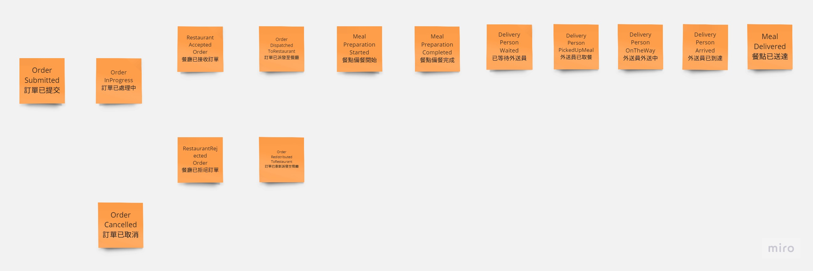

# ChainwideFoodOrderingSystem

## 情境說明

使用者可在任何地方透過點餐系統點餐送單，上傳至點餐核心系統。

核心系統收單後自動派送至距離使用者最近的餐廳據點備餐。

備餐完成後透過待送餐點系統提供內部外送員外送資訊、取單確定外送功能。

開始外送時於外送系統顯示外送路徑與餐點資料

使用者端同步顯示外送員外送進度

資料於外送系統餐點送達後結束。

設計內容包含此系統整體架構、後端程式功能模組拆分，你認為會使用到的所有類型Service、資料交換方式，並說明你的設計理由，可用任何型式表示。

## Event Storming 

與所有關係人進行 Event Storming 抓取可能淺藏的領域事件。

劃分淺在地Bounded Context。