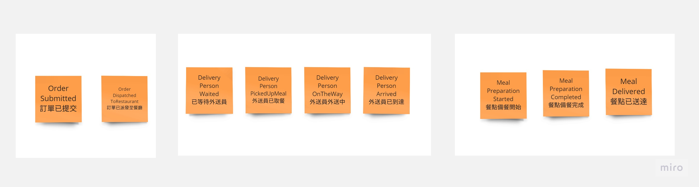

# ChainwideFoodOrderingSystem

## 情境說明

使用者可在任何地方透過點餐系統點餐送單，上傳至點餐核心系統。

核心系統收單後自動派送至距離使用者最近的餐廳據點備餐。

備餐完成後透過待送餐點系統提供內部外送員外送資訊、取單確定外送功能。

開始外送時於外送系統顯示外送路徑與餐點資料

使用者端同步顯示外送員外送進度

資料於外送系統餐點送達後結束。

設計內容包含此系統整體架構、後端程式功能模組拆分，你認為會使用到的所有類型Service、資料交換方式，並說明你的設計理由，可用任何型式表示。

## Event Storming 

與所有關係人進行 Event Storming 抓取可能淺藏的領域事件。

劃分淺在地Bounded Context。

- 訂單服務
- 外送員服務
- 餐廳服務中的餐點 or 餐廳服務及餐點服務 (資料一致性採用最終一致性。非強一致性)

## 實作技術

- 採用 RestfulAPI Http同步式API及事件驅動架構的非同步式API。

- Event Driven中的 Event Bus實作使用RabbitMQ。為了確保資料一致性及網路不穩定性。在訂單服務及餐廳服務之間需要實作 
[TransactionOutboxPattern](https://learn.microsoft.com/en-us/azure/architecture/best-practices/transactional-outbox-cosmos)

- 從使用者所在座標可以使用ElasticSearch進行座標優化查詢。

## 軟體架構

- 採用整潔架構，降低對於資料庫及外部展現層依賴，只關注商業流程及商業邏輯實現。
- 更易於進行單元測試及自動化測試

